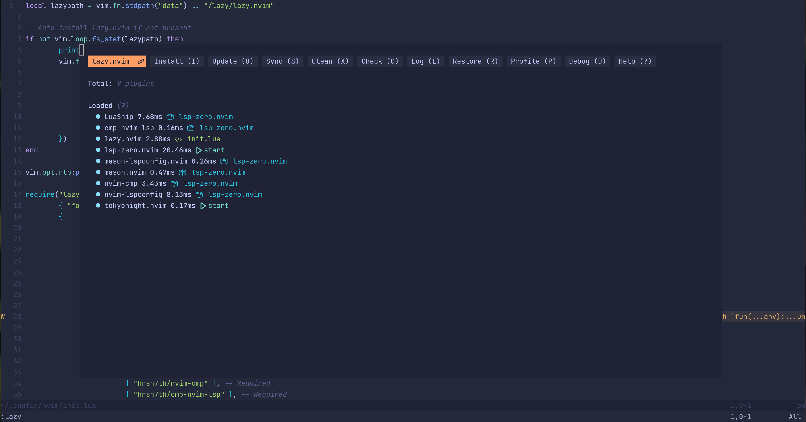

# Lsp-Zero in Docker

- Try [NeoVIM](https://github.com/neovim/neovim) and [lsp-zero.nvim](https://github.com/VonHeikemen/lsp-zero.nvim) inside Docker container.
- Out-of-box SSH.
- Base: [archlinux](https://hub.docker.com/_/archlinux)

## Glance



## Usage

### Build Image

```shell
$ git clone https://github.com/Pagliacii/docker-lsp-zero
$ cd docker-lsp-zero
$ docker build -t docker-lsp-zero:latest .
```

### Run Container

```shell
$ docker run \
  -d --name "lsp-zero" \
  -p 23333:2222 \
  -e USERID=100 \                # optional
  -e USERNAME=jason \            # optional
  -e PASSWORD=mysecretpassword \ # optional
  -e PORT=2222 \                 # optional
  -e PUBLICKEY=xxx \             # optional
  -e PASSWORD_ACCESS=true \      # optional
  -e ROOT_PASSWORD=roottoor \    # optional
  -e SUDO_ACCESS=true \          # optional
  --restart unless-stopped \     # optional
  docker-lsp-zero:latest
```

Or use `docker-compose`:

```yaml
---
services:
  lsp-zero:
    image: docker-lsp-zero:latest
    container_name: lsp-zero
    ports:
      - "23333:2222"
    environment:
      - USERID=100                # optional
      - USERNAME=jason            # optional
      - PASSWORD=mysecretpassword # optional
      - PORT=2222                 # optional
      - PUBLICKEY=                # optional
      - PASSWORD_ACCESS=true      # optional
      - ROOT_PASSWORD=roottoor    # optional
      - SUDO_ACCESS=true          # optional
    restart: unless-stopped
```

### Connect via SSH

```shell
$ ssh jason@localhost -p 23333
```

